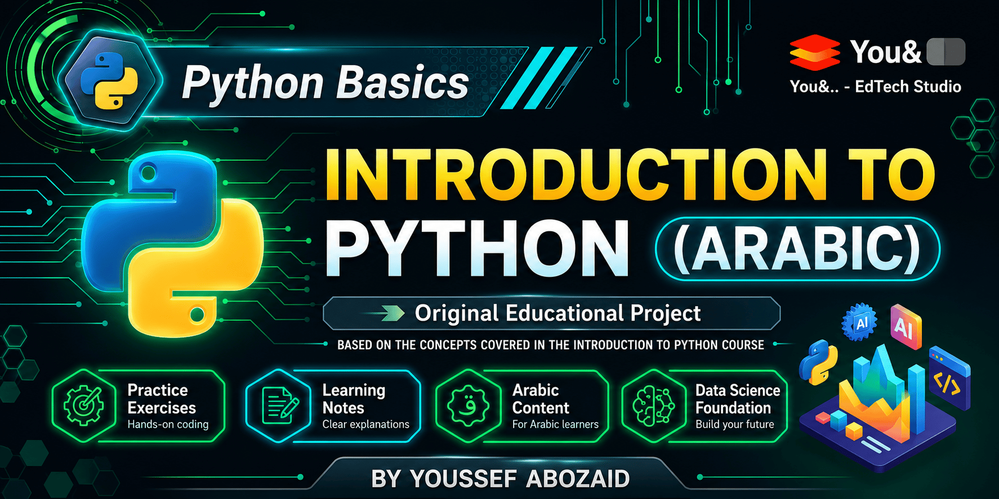

\# Introduction to Python (Arabic)


> An original Arabic educational project based on the concepts covered in DataCamp's \*\*Introduction to Python\*\* course.


!\[Status](https://img.shields.io/badge/Status-Completed-brightgreen)

!\[Language](https://img.shields.io/badge/Language-Arabic-blue)

!\[Python](https://img.shields.io/badge/Python-3.x-yellow)

!\[NumPy](https://img.shields.io/badge/NumPy-Learning-blue)

!\[Markdown](https://img.shields.io/badge/Markdown-Documentation-lightgrey)


\---


\# About This Project


This repository documents my learning journey while studying DataCamp's \*\*Introduction to Python\*\* course.


Instead of simply completing the course, I created a complete Arabic educational project that includes my own explanations, examples, exercises, notes, videos, and supporting materials to help Arabic-speaking learners understand Python for Data Science.


> \*\*Disclaimer\*\*

>

> This repository is \*\*not affiliated with or endorsed by DataCamp\*\*.

>

> DataCamp owns all rights to its original course, trademarks, and educational platform.

>

> All explanations, examples, PDF slides, Python files, Markdown notes, videos, thumbnails, and supporting educational materials contained in this repository were independently created by me.


\---


## Repository Structure

```text
Introduction-to-Python-Arabic-Course/

├── README.md
├── LICENSE
├── .gitignore
├── PDFs/
├── Videos/
├── Thumbnails/
└── Course Materials/
    ├── 01 - Python Basics/
    ├── 02 - Python Lists/
    ├── 03 - Functions and Packages/
    └── 04 - NumPy/
```


\---


\# Course Chapters


| Chapter | Topics |

|---------|--------|

| 01 - Python Basics | Variables, Data Types, Type Conversion, Basic Operations |

| 02 - Python Lists | Lists, Indexing, Slicing, Nested Lists |

| 03 - Functions and Packages | Functions, Methods, Packages, Modules |

| 04 - NumPy | Arrays, Vectorized Operations, Boolean Indexing |


\---


\# Repository Contents


\## PDFs


Original PDF slides created specifically for this Arabic course.


\---


\## Videos


Arabic video lessons explaining every chapter of the course.


\---


\## Course Materials


Each chapter includes:


\- Python practice files

\- Markdown learning notes

\- Exercise instructions

\- Chapter documentation


\---


\## Thumbnails


Custom YouTube thumbnails created for every chapter.


\---

\# Skills Practiced


Throughout this project I practiced:


\- Python Programming

\- NumPy

\- Technical Documentation

\- Markdown

\- Educational Content Creation

\- Repository Organization

\- GitHub Documentation

\- Problem Solving


\---


\# Technologies Used


\- Python

\- NumPy

\- Markdown

\- Obsidian

\- Git

\- GitHub


\---


\# Learning Workflow


For each chapter, I followed this workflow:


1\. Study the concepts.

2\. Create original Arabic explanations.

3\. Design PDF slides.

4\. Write Markdown learning notes.

5\. Solve and document exercises.

6\. Create Python practice files.

7\. Record and publish the lesson on YouTube.


\---


\# Project Goal


The primary goal of this repository is to make Python fundamentals more accessible to Arabic-speaking learners through structured, practical, and well-documented educational content.


\---


\# Future Plans


\- Continue documenting additional Python topics.

\- Create Arabic educational repositories for more DataCamp courses.

\- Improve the learning materials over time.

\- Expand the collection of practical exercises.


\---


\# Author


\*\*Youssef Abozaid\*\*


Computer Science Student (Data Science \& AI)


YouTube:

https://www.youtube.com/@YoussefAbozaid_You


GitHub:

https://github.com/youssefabozaidyou


Email:

youssefabozaid.you@gmail.com


\---


\# Copyright


This repository contains original educational materials created by \*\*Youssef Abozaid\*\*.


The project is based on the concepts covered in DataCamp's \*\*Introduction to Python\*\* course.


DataCamp owns all rights related to its original course and trademarks.


All explanations, examples, Python files, Markdown notes, PDF slides, videos, thumbnails, and supporting educational materials contained in this repository were independently created by the author and are shared for educational purposes.

